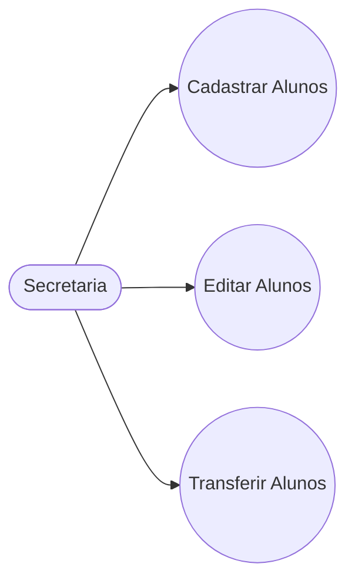
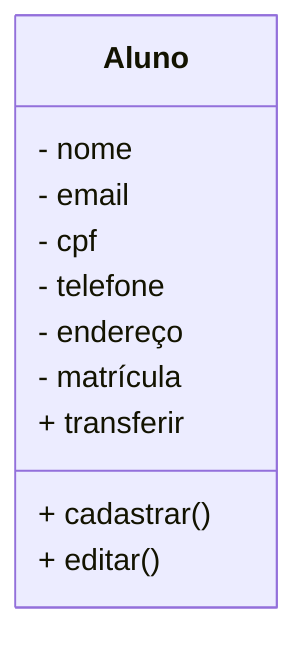

# Projeto Universidade

Modelagem em Orientação à Objetos das Entidades Alunos,Cursos e Turmas

# Caso de Uso

## Diagrama de Classes

# Bibliotecas Python
Este é um projeto desktop, utilizando as tecnologias:
## Lib python
- Python
- PySide6
- PyInstaller

# Funções MySQL
- CREATE - Cria tabelas dentro da base de dados
- INSERT - Cria registro dentro das tabelas

- SELECT - Permiti vizualizar os dados dentro das tabelas. Também permite filtrar os dados que quer vizualizar.

- ALTER - Altera a estrutura das tabelas adicionando ou removendo atributos(campos ou colunas).

- UPDATE - Atualiza registros dentro da tabela.
- Drop - Exclui a tabela ou a base de dados inteira.
- DELETE - Exclui registros dentro das tabelas.

# Conceitos MySQL
- Banco de dados: Programa hospedado na máquina com objetivo de persistir os dados fisicamente no HD.
- Base de dados: Conjunto de tabelas.
- Tabelas: Conjunto de registros
- Registros: Uma linha na tabelas, contendo a informação dos seus atributos.
-Atributos: Uma das caracteristicas da tabela (Colunas).

## Dependências
+ **VsCode**: IDE(Interface de desenvolvimento)
- **Mermaid**: Linguagem para confecção de diagrama em documentos MD(Mark Down)
+ **Material Icon Theme**: Tema para colorir as pastas.
- **Git Lens**: Interface gráfica pra o versionamento .git integrada ao VSCode.
+ **MySQL**: SGBD(Sistema Gerenciador de Banco de Dados). Permite conectar o usuário como servidor MySQL, possibilitando criar base de dados, tabelas, incluir e modificar atributos e registros.